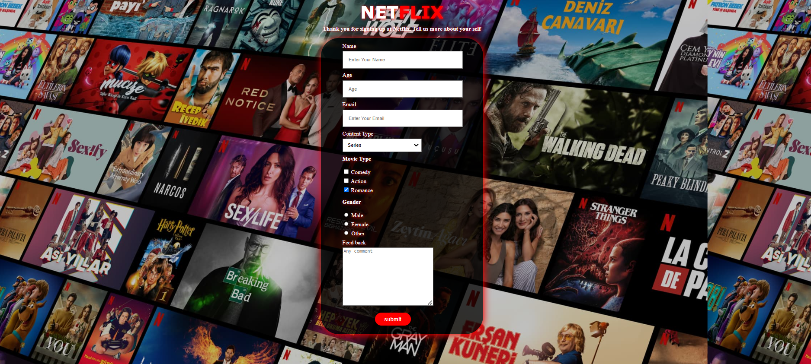

<p align="left">
<a href="https://www.linkedin.com/in/ozkankomu/" target="_blank"></a>
</p>

# Project :Netflix Survey Form 


## Table of contents

  - [The challenge](#the-challenge)
  - [Project Design](#project-design)
  - [Screenshot](#screenshot)
  - [Project Skeleton](#project-skeleton)
  - [Links](#links)
  - [Built with](#built-with)
  - [Steps To Project](#steps-to-project)
  - [Useful resources](#useful-resources)
- [Author](#author)


## The challenge
Project aims to create survey form within html and css that looks identical to Netflix page.

## Problem Statement

- Your company has recently started on a project that aims to conduct a survey to measure the demands and interests of its customers. So you and your colleagues have started to work on the project.

## Project Design

- <a href="https://www.figma.com/file/HXULRJVkPlaCpxQlbm82bX/Project001?node-id=6%3A4">https://www.figma.com/file/HXULRJVkPlaCpxQlbm82bX/Project001?node-id=6%3A4<a>

## Project Skeleton 

```
netflix-clone (folder)
        |----index.html  
        |----style.css   
```
## Links

- [live site URL here: ([Live Website)](https://ozkankomu.github.io/NETFLIX_Project/)

## Screenshot
<p align="center">
<a href="https://ozkankomu.github.io/NETFLIX_Project/"></a>
</p>

### Built with

- Semantic HTML5 markup
- CSS custom properties
- Flexbox
- CSS Grid
- Mobile-first workflow

- [Styled Components](https://styled-components.com/) - For styles
	
- HTML Forms-Input Types 

- HTML Form Elements

- CSS Colors-Border Properties

- CSS Margins-Padding

- CSS Properties for Texts-Font Families-Links


## Steps to Project

- Step 2: Create project folder for local public repo on your pc

- Step 3: Create Survey Form

>>Part-1 HTML Structure
	- Creat structure of the HTML5
	- Give name of your project (title)
	- Create the main structure of the container (div id="container")
	- Create Main Topic of the project (id="title")
	- Create a description of your project (id="description")
	- Create a form (id="survey-form")
	- Create 4 divisions (class="box") for each label and single-line text input field (Tips:dont forget to use placeholder)
	- Create a division (class="box") for a dropdown list. (Tips:dont forget to use a label tag)
	- Create a division (class="box") for checkbox list
	- Create a division (class="box") for radio buttons
	- Create a division (class="box") for a multi-line input field (Tips: a text area)
	- Create a button for id="submit" the form

>>Part-2 CSS Structure
	- Set a background and define font-color="white"
	- Set container background color and margin
	- Define "title" and "description" color-size-padding etc...
	- Define "survey-form" color-size-padding etc..
	- Define labels color-size-padding etc... (Tips: id="name", "email", "number" ...)
	- Set class color-size-padding-margin etc...
	- Define id="submit" color-size-padding etc...
	
-

## Notes

- You can use HTML,and CSS to complete this project.

### Useful resources

- [W3 Schoold](https://www.w3schools.com/) - This helped me for basics of website paradigm. I really liked this pattern and will use it going forward.
- [MDN](https://developer.mozilla.org/en-US/) - This is an amazing document which helped me finally understand deep sides of web development. I'd recommend it to anyone still learning these concepts.


## Author

- Author - [Ozkan]

<center> &#8987; Happy Coding  &#9997; </center>
